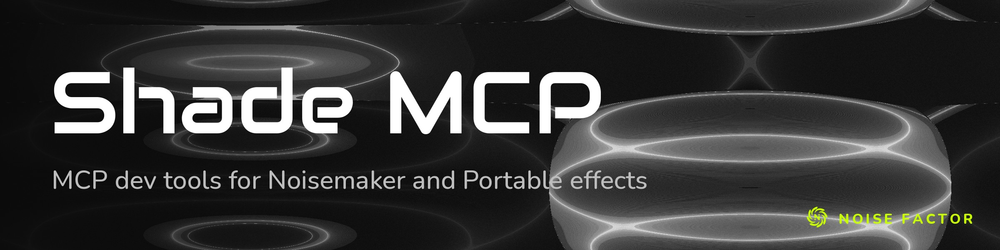

<!-- repo-hero -->
<a href="https://shade.noisedeck.app/"></a>

<sub>Open source from <a href="https://noisefactor.io">Noise Factor</a> &middot; <a href="https://github.com/noisefactorllc">more projects</a></sub>

# shade-mcp

MCP server for shader effect development.

Distilled from three projects:
- **[noisemaker](https://noisemaker.app/)** — browser-based shader testing
- **[portable](https://github.com/noisefactorllc/portable)** — portable effect authoring
- **[shade](https://shade.noisedeck.app)** — agent-assisted shader editing

## Requirements

- Node.js 22 or newer
- A viewer page, for the browser tools only — shade-mcp does not bundle one. See [Viewer](#viewer).

## Quick Start

```bash
npm install            # installs dependencies and builds dist/
npm run setup          # install Playwright Chromium (browser tools only)
```

**Using shade-mcp with noisemaker or portable?** See [docs/SETUP.md](docs/SETUP.md) for step-by-step configuration.

## Viewer

The eight browser tools use Chromium to control a viewer page that hosts the renderer.
shade-mcp does not include a viewer.
Set `SHADE_VIEWER_ROOT` to the smallest directory containing the viewer and its imported modules.
The page must expose the renderer through window globals.
Set `SHADE_GLOBALS_PREFIX` to match those globals.

| Project | `SHADE_VIEWER_ROOT` | `SHADE_VIEWER_PATH` | `SHADE_GLOBALS_PREFIX` |
|---------|---------------------|---------------------|------------------------|
| noisemaker | `<noisemaker>` | `/demo/shaders/` | `__noisemaker` |
| portable | `<portable>/viewer` | *(default `/`)* | `__portable` |

noisemaker's viewer page is in `demo/shaders/` and imports the engine from `shaders/src/` at the repository root.
For noisemaker, set `SHADE_VIEWER_ROOT` to the repository root.
If you use the page's directory as the root, every module request returns 404.
The server refuses dotfiles regardless of the root.

The analysis, knowledge, and utility tools read from disk and need no viewer.

## Configuration

Environment variables:

| Variable | Default | Description |
|----------|---------|-------------|
| `SHADE_EFFECTS_DIR` | `<project root>/effects` | Path to the effects library |
| `SHADE_PROJECT_ROOT` | cwd | Project root, used for relative paths and AI key lookup |
| `SHADE_VIEWER_ROOT` | `<project root>/viewer` | Directory served as the viewer |
| `SHADE_VIEWER_PATH` | `/` | Path within the viewer to open |
| `SHADE_VIEWER_PORT` | `0` (OS-assigned) | Port for the local viewer server |
| `SHADE_GLOBALS_PREFIX` | `__shade` | Prefix of the viewer's window globals |
| `SHADE_BACKEND` | `webgl2` | Default rendering backend (`webgl2` or `webgpu`) |
| `SHADE_MAX_BROWSERS` | `1` | Concurrent browser sessions |
| `SHADE_HEADLESS` | `1` (headless) | Set to `0` to watch the browser window |
| `SHADE_TIMEOUT_MS` | `120000` | Ceiling for every browser and page operation |
| `SHADE_AI_TIMEOUT_MS` | `120000` | Ceiling for a single AI provider request |
| `SHADE_AI_MODEL` | provider default | Model used by the AI-powered tools |
| `ANTHROPIC_API_KEY` | — | Required for AI-powered tools (vision, analysis) |
| `OPENAI_API_KEY` | — | Fallback AI provider |

## MCP Client Configuration

### Claude Code

```json
{
  "mcpServers": {
    "shade": {
      "command": "node",
      "args": ["/path/to/shade-mcp/dist/index.js"],
      "env": {
        "SHADE_EFFECTS_DIR": "/path/to/effects"
      }
    }
  }
}
```

### VS Code Copilot

In `.vscode/mcp.json`:

```json
{
  "servers": {
    "shade": {
      "command": "node",
      "args": ["/path/to/shade-mcp/dist/index.js"],
      "env": {
        "SHADE_EFFECTS_DIR": "/path/to/effects"
      }
    }
  }
}
```

### Cursor

In `.cursor/mcp.json`:

```json
{
  "mcpServers": {
    "shade": {
      "command": "node",
      "args": ["/path/to/shade-mcp/dist/index.js"],
      "env": {
        "SHADE_EFFECTS_DIR": "/path/to/effects"
      }
    }
  }
}
```

### Windsurf

In `~/.codeium/windsurf/mcp_config.json`:

```json
{
  "mcpServers": {
    "shade": {
      "command": "node",
      "args": ["/path/to/shade-mcp/dist/index.js"],
      "env": {
        "SHADE_EFFECTS_DIR": "/path/to/effects"
      }
    }
  }
}
```

## Tool Reference

### Browser Tools (8)

These tools require Playwright Chromium and a viewer (see [Viewer](#viewer)).

| Tool | Description |
|------|-------------|
| `compileEffect` | Compile a shader effect. Return diagnostics for each pass. Use comma-separated effect IDs for a batch. |
| `renderEffectFrame` | Render one frame. Return mean RGB, variance, and blank/monochrome detection. Optionally capture a PNG. |
| `describeEffectFrame` | Render a frame. Analyze the image with AI vision. The tool requires `ANTHROPIC_API_KEY` or `OPENAI_API_KEY`. |
| `benchmarkEffectFPS` | Measure FPS, jitter, and frame timing statistics against a target frame rate. |
| `testUniformResponsiveness` | Check whether each uniform changes the output. Return a pass/fail result for each uniform. |
| `testNoPassthrough` | Check that filter effects change their input (>1% pixel difference). |
| `testPixelParity` | Compare WebGL2 and WebGPU output pixel by pixel within the epsilon tolerance. |
| `runDslProgram` | Compile arbitrary DSL code. Execute the program. Return metrics and pass status. |

### Analysis Tools (4)

These tools analyze files on disk and do not need a browser.

| Tool | Description |
|------|-------------|
| `checkEffectStructure` | Detect unused files, broken references, naming violations, leaked uniforms, and structural parity issues. |
| `checkAlgEquiv` | Compare the semantics of GLSL/WGSL pairs with AI. The tool requires an AI key. |
| `compareShaders` | Compare shader structure: function names, uniforms, and line counts. |
| `analyzeBranching` | Analyze unnecessary shader branching with AI. Return optimization suggestions. The tool requires an AI key. |

### Knowledge Tools (4)

In-memory search indexes.

| Tool | Description |
|------|-------------|
| `searchEffects` | Search effect library by concept, tag, algorithm, or visual style. |
| `analyzeEffect` | Return the full definition, shader source, uniforms, and passes for an effect ID. |
| `searchShaderSource` | Search GLSL source code across all effects with a regular expression. |
| `searchShaderKnowledge` | Search curated shader documentation by meaning: DSL grammar, GLSL techniques, patterns, and errors. |

### Utility Tools (2)

| Tool | Description |
|------|-------------|
| `listEffects` | List all effects, optionally filtered by namespace. |
| `generateManifest` | Rebuild effect manifest by scanning effects directory. |

## Development

```bash
npm test           # run tests
npm run typecheck  # tsc --noEmit, including tests
npm run build      # build with tsup
npm run dev        # watch mode
```

Tests and typecheck are separate checks. Vitest does not typecheck. Run both commands.

## License

MIT
